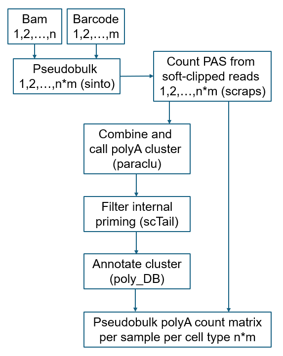

# PASpipline

### A pipeline to quantify polyA site (PAS) counts from "TVN"-primed single-cell RNA-Seq Read2.

## Installation
```bash
cd envs
conda env create -f env_APA.yml
conda env create -f env_scraps_conda.yml
conda env create -f env_scTail.yml
```

## Run
```bash
bash main.sh
```

## Workflow
<div>

</div> 

## Input
Please edit 3 input variables in main.sh
```bash
sample_sheet="/path/to/your/samplesheet.csv"
output_base_dir="/path/to/your/output"  
input_fasta_file="/path/to/your/genome.fa"  
```
samplesheet.csv:
```
sample_id_1,/path/to/your/sample_1.bam,/path/to/your/barcode_1.tsv
sample_id_2,/path/to/your/sample_2.bam,/path/to/your/barcode_2.tsv
sample_id_3,/path/to/your/sample_3.bam,/path/to/your/barcode_3.tsv
```

## Output
polyA_cluster_count_matrix.tsv:
```
sample_id  cell_type  polyA_cluster_1  polyA_cluster_2  ...  polyA_cluster_n
```
